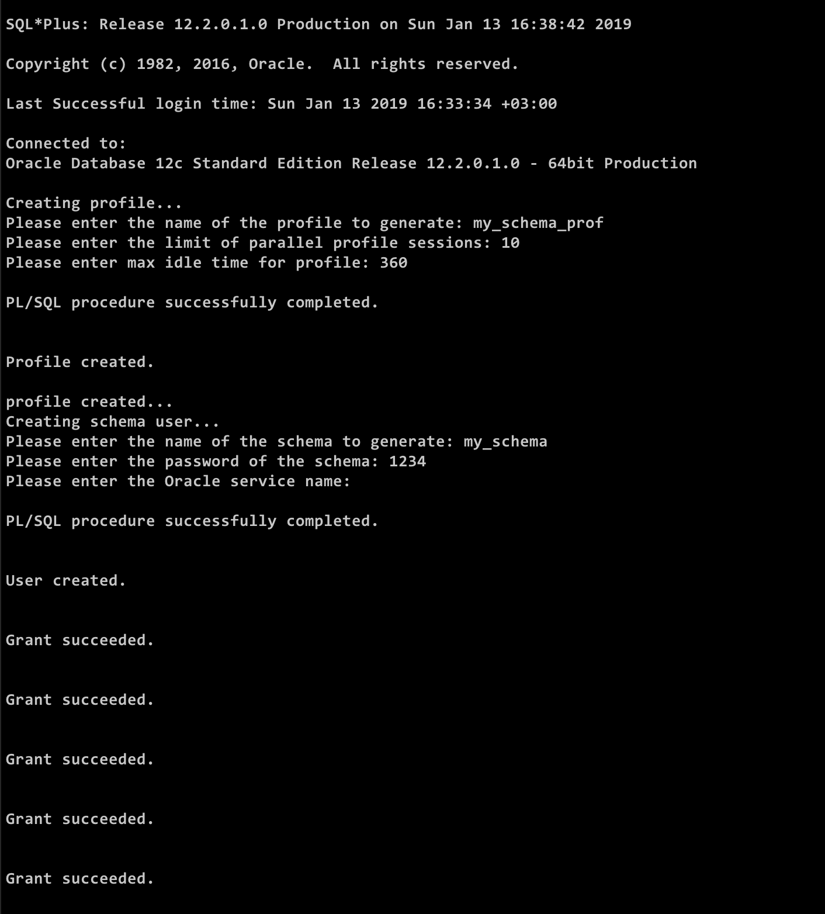
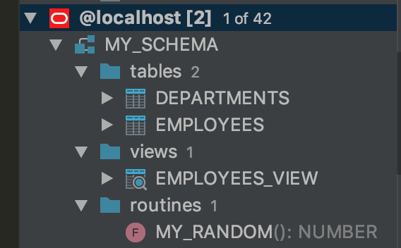
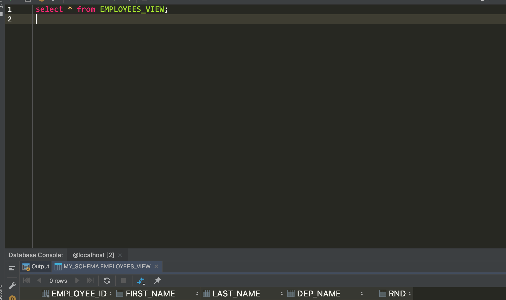

# Задание 2-3

[Полный скрипт](3_user_creation_w_rights.sql)

Модифицируйте скрипт создания пользователя, приведенный в
примере. Добавьте в скрипт создание профиля с ограничениями
на количество параллельных сеансов и время простоя.
Организуйте привязку создаваемого пользователя к профилю.

__Создание профиля__

```sql
rem dropping the profile if already exists
declare
        res number;
begin
        select count(1) into res from DBA_PROFILES where upper(profile) = upper('&profile_name');

        if res <> 0 then
                execute immediate 'drop profile ' || upper('&profile_name') || ' cascade';
        end if;
end;
/

create profile &profile_name limit IDLE_TIME &profile_max_idle_time SESSIONS_PER_USER &profile_parallel;
```

__Создание пользователя__

```sql
rem dropping the user if already exists
declare
        res number;
begin
        select count(1) into res from all_users where upper(username) = upper('&schema_name');

        if res <> 0 then
                execute immediate 'drop user ' || upper('&schema_name') || ' cascade';
        end if;
end;
/
```

Дополнить скрипт из предыдущего задания (2) выдачей
достаточных системных привилегий создаваемому
пользователю-разработчику, создать объекты от имени
пользователя-разработчика (пару таблиц, пару процедур, пару
представлений), создать роль для пользователя приложения и
выдать этой роли привилегии на созданные объекты. Создать
пользователя приложения и убедиться, что объекты ему
доступны.

__Выдача привелегий__

```sql
create user &schema_name identified by &schema_password PROFILE &profile_name;
grant connect to &schema_name;
grant create table to &schema_name;
grant create sequence to &schema_name;
grant create view to &schema_name;
grant create procedure to &schema_name;
GRANT UNLIMITED TABLESPACE TO &schema_name;
```

__Создание объектов от имени создаваемого пользователя__

```sql
declare
begin
execute immediate 'ALTER SESSION SET CURRENT_SCHEMA = &schema_name';
end;
/

CREATE TABLE departments
(
dep_id  NUMBER(6) PRIMARY KEY,
dep_name  VARCHAR(20)
)
ENABLE PRIMARY KEY USING INDEX;

CREATE TABLE employees
(
employee_id  NUMBER(6) PRIMARY KEY,
dep_id      NUMBER(6) NOT NULL,
first_name  VARCHAR(20),
last_name   VARCHAR(25),
email       VARCHAR(25),
sallary     NUMBER(8, 2)
)
ENABLE PRIMARY KEY USING INDEX;

ALTER TABLE employees ADD CONSTRAINT emp_fk1
FOREIGN KEY (dep_id) REFERENCES departments (dep_id);

CREATE OR REPLACE FUNCTION my_random
RETURN number
IS
rnd number;
begin
  rnd := round(dbms_random.value(1,10));
  return rnd;
end;
/

CREATE OR REPLACE VIEW employees_view AS
SELECT employee_id, first_name, last_name, dep_name, my_random AS rnd
FROM employees e
INNER JOIN departments d ON e.dep_id = d.dep_id;
```

__Создаем пользователя__

```bash
$ sqlplus system/password 3_user_creation_w_rights.sql
```

Результат




Объекты созданы:



Есть доступ


