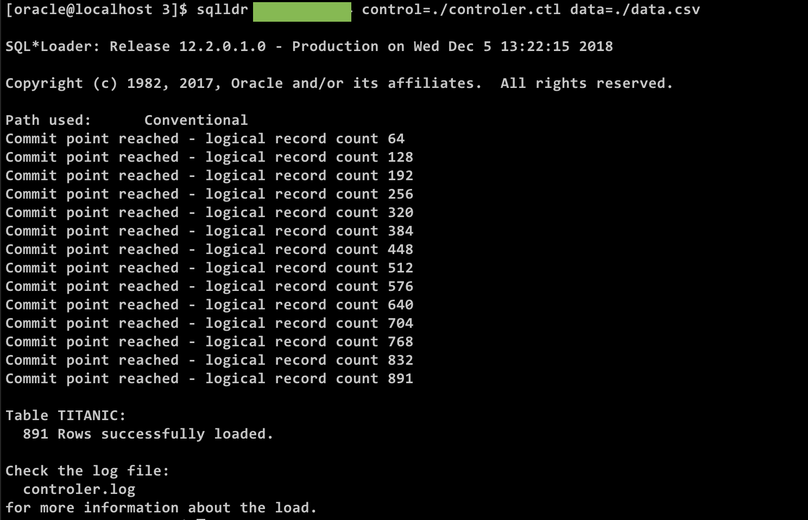
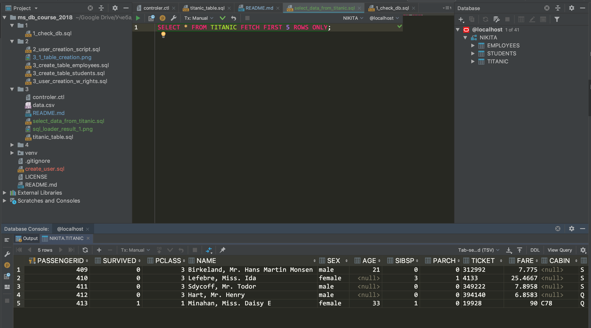
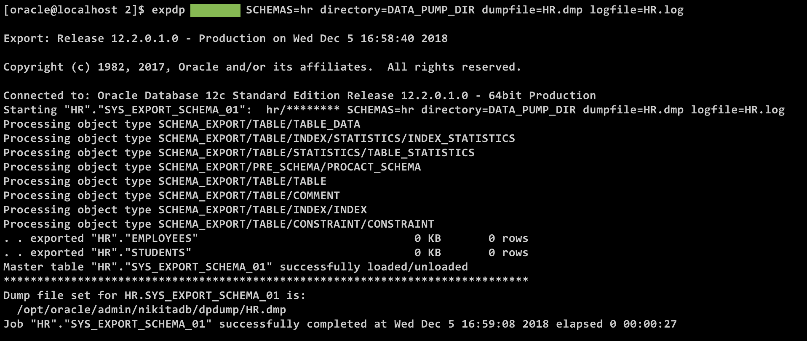
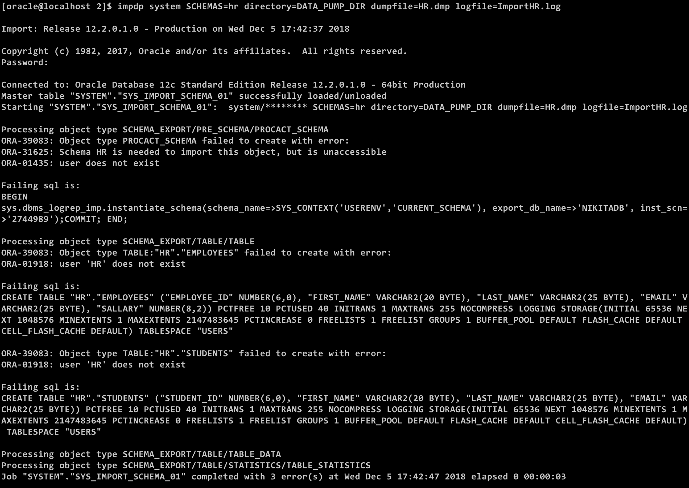

# Демонстрация использования утилит загрузки/выгрузки базы.

## On SQL Loader

Найдите dataset с разнообразными типами данных (строки, числа целые и вещественные, 
даты в разных форматах и т.п.) и загрузите его в базу данных ORACLE с помощью утилиты SQL*Loader.

### SQL Loader usage

```sql
sqlldr usr/usr control=./controler.ctl data=./data.csv
```

Result





## On SQL Dump
__Создать дамп HR.__

Из [2](../2) запустить скрипт по созданию пользователя.

В качестве `system`

```sql
SQL> CONN / AS SYSDBA
SQL> GRANT READ, WRITE ON DIRECTORY DATA_PUMP_DIR TO hr;
SQL> GRANT CREATE USER TO hr;
```

Надо накинуть права на создание юзера, потому что иначе потом не загрузится потому что
[вот](https://stackoverflow.com/questions/19574963/impdp-does-not-create-user-schema)

```
$ expdp hr SCHEMAS=hr DIRECTORY=DATA_PUMP_DIR DUMPFILE=HR.dmp
```



__Уничтожить схему HR.__

```sql
SQL> DROP USER hr CASCADE;
```

__Поднять схему HR из дампа.__

```
$ impdp system SCHEMAS=hr directory=DATA_PUMP_DIR dumpfile=HR.dmp logfile=ImportHR.log
```



# Литература
- [Lecture on SQL Loader](https://drive.google.com/file/d/1Kz269PwfNYblJMGcRZDos-ctPs1w8JU8/view?usp=sharing)
- [Lecture on Oracle Dump](https://drive.google.com/file/d/1vqVwtiDszJxgXTsDEnHXzuc5np7YZy4V/view?usp=sharing)
- [Экспорт и импорт дампа базы данных Oracle с помощью утилит expdp и impdp](https://info-comp.ru/sisadminst/588-oracle-data-pump-expdp-impdp.html)
- [Надо не забыть накинуть юзеру, которого дропаем, права на созадние юзера](https://stackoverflow.com/questions/19574963/impdp-does-not-create-user-schema)