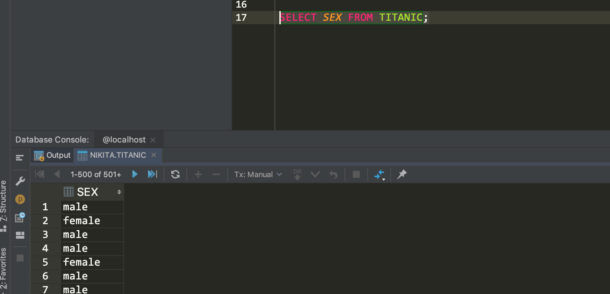
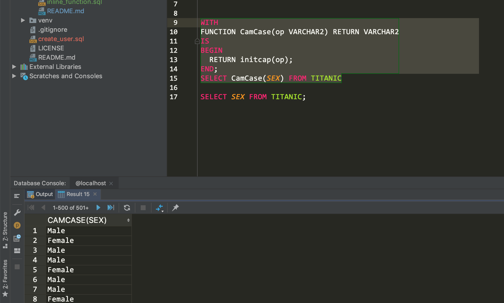

# Демонстрация двух любых новых возможностей Oracle 12c

## JSON in Oracle Database

https://docs.oracle.com/database/121/ADXDB/json.htm#ADXDB6246

## APPROX_COUNT_DISTINCT

https://docs.oracle.com/database/121/SQLRF/functions013.htm#SQLRF56900

```sql
SQL> SELECT APPROX_COUNT_DISTINCT(EMBARKED) AS "Embarked" FROM TITANIC;
```


## Inline Functions
```sql
WITH
FUNCTION CamCase(op VARCHAR2) RETURN VARCHAR2
IS
BEGIN
  RETURN initcap(op);
END;
SELECT CamCase(SEX) FROM TITANIC
```

__No function applied__



__Function applied__

