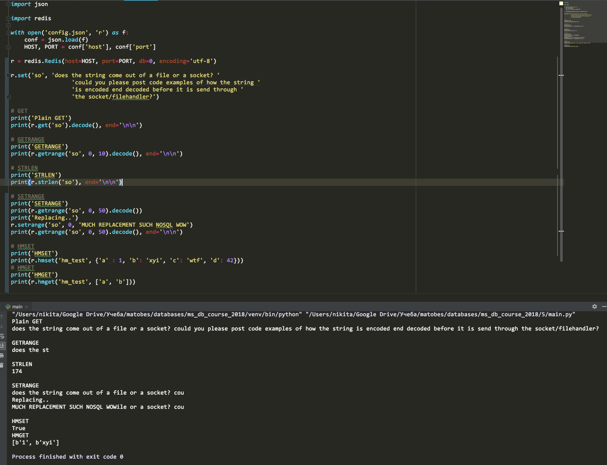

# Создание key-value хранилища и демонстрация 5 запросов к этому хранилищу.

1. На вируалке надо отрубить фаервол `$ systemctl stop firewalld`
2. Использовать [этот конфиг](redis.conf)

# Литература

- https://www.tutorialspoint.com/redis/index.htm

