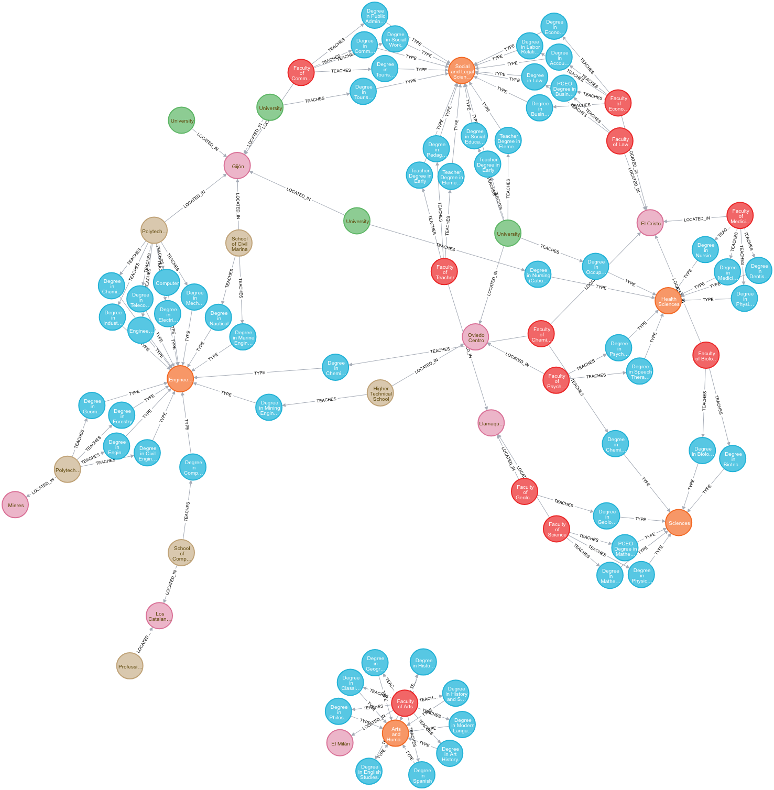
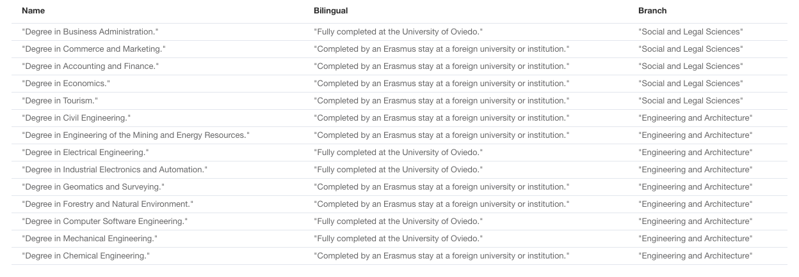
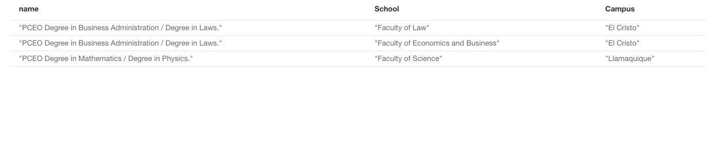
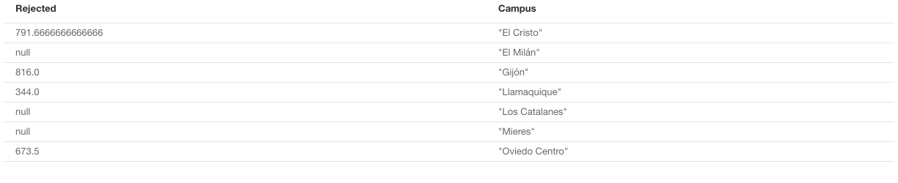
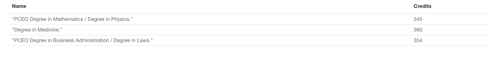
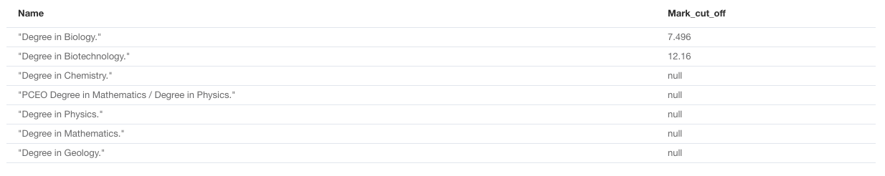

# Создание графовой базы и демонстрация 5 запросов к этой базе.

Для выполнения задания мы взяли данные о поступлении в [Универстит Овьедо](https://en.wikipedia.org/wiki/University_of_Oviedo).

Университет дает возможность обучаться различным _степеням_ (Degrees), 
которые относятся к различным _ответвлениям_ (branches).
Помимо этого, степени могут преподаваться _факультетами_ (Faculty), _школами_ (School) и 
_институтами-партнерами_ (Partner institution).
Школы и факультеты являются публичными учереждениями, как и сам универститет, к которому они относятся, 
однако иституты-партнеры - это частные учереждения, которые подписали договор с Университетом о совместном проведении
курсов.

Помимо этого, школы, факультеты и институты-партнеры находнятся в кампусе (Campus).


- _Степень в области машиностроения_: имеет 240 кредитов, в 2013 году получил 260 новых студентов 
и предлагает возможность получить двуязычную степень. 
Кроме того, он преподается в _Политехнической школе инженерии Хихона_, основанной в 1888 году. 
Он относится к _отрасли машиностроения и архитектуры_.
- _Диплом по социальной работе_: также имеет 240 кредитов и в 2013 году получил 54 новых студента. 
Преподается на _факультете торговли, туризма и социальных наук Jovellanos_, основанном в 1899 году. 
Относится к отрасли _социально-правовых наук_.
- _Образование медсестры (Cabueñes)_: как и другие, имеет 240 кредитов. В 2013 году было предложено 70 мест,
и 886 студентов подали заявки на получение этой степени, но только 70 получили. 
Эта степень имеет проходной балл 10.476, а максимально возможным является 14. 
Она _проводится_ в вузом-партнером, университетом _School of Nursing Cabueñes Gijon_. 
Она относится к отрасли медицинских наук.

Школа, факультет и учреждение-партнер, названные выше, расположены в кампусе Хихон, в городе Хихон.

__Loading dataset__

Датасет загружается через `.cypher` [файл](import_schools.cypher), содержащий в себе всю информацию об учереждении.

Вот как выглядит загруженный датает:

_Выбор всей базы_

```cypher
MATCH (n) RETURN n
```

Результат:



# Запросы

## Запрос 1

Выведем все степени, которые преподаются на двух языках:

```cypher
MATCH (d:Degree)-[:TYPE]->(b) WHERE exists(d.bilingual) RETURN d.name AS Name, d.bilingual AS Bilingual, b.name AS Branch;
```

Результат:



## Запрос 2

Какие степени выдают два диплома:

```cypher
MATCH (d:Degree)<-[:TEACHES]-(s)-[:LOCATED_IN]->(c:Campus) 
WHERE exists(d.double_Degree) RETURN d.name AS name, s.name AS School, c.name AS Campus;
```

Результат:



## Запрос 3

Среднее количетсво студентов, которые подавали заявление на степень, но не поступили

```cypher
MATCH (d:Degree)<-[:TEACHES]-(s)-[:LOCATED_IN]->(c:Campus) 
RETURN 
avg((d.applications)-(d.students_first_year_2013)) AS Rejected, 
c.name AS Campus 
ORDER BY c.name;
```

Результат



## Запрос 4

Степени, у которых количество возможных кредитов выше среднего.

```cypher
MATCH (d:Degree) 
WITH d, avg(d.credits) AS average MATCH (a:Degree) 
WHERE a.credits > average 
RETURN DISTINCT 
a.name AS Name, 
a.credits AS Credits;
```

Результат



## Запрос 5

Все степени, которые можно получить в научной отрасли.

```cypher
MATCH (b)-[:TYPE]-(d:Degree)<-[:TEACHES]-(f)-[:LOCATED_IN]-(c:Campus) 
WHERE b.name='Sciences' 
RETURN 
d.name AS Name, 
d.mark_cut_off AS Mark_cut_off 
ORDER BY d.mark_cut_off;
```

Результат

